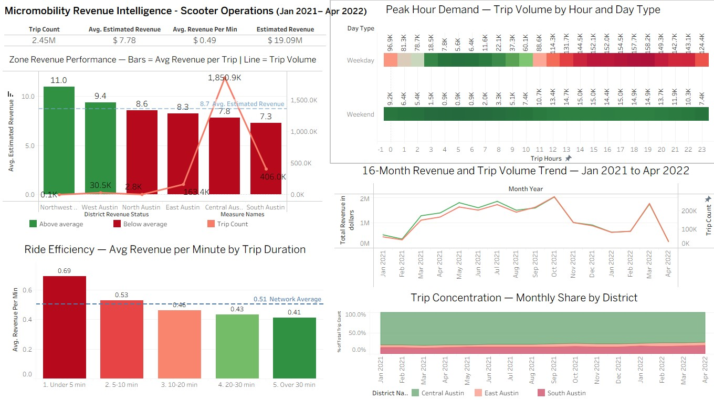
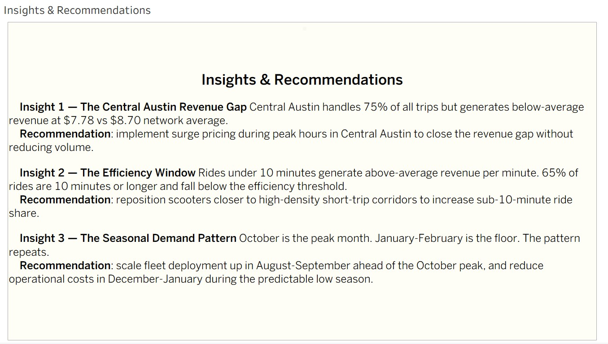

# Micromobility Revenue Intelligence — Snowflake + SQL + Tableau

> A full-stack analytics pipeline that surfaces five operational insights across 2.45M scooter trips in Austin, TX — built on Medallion Architecture in Snowflake and visualized in a 5-page Tableau Public dashboard.

## Overview

| | |
|---|---|
| **Domain** | Micromobility / Urban Transportation Operations |
| **Tools** | Snowflake · SQL · Tableau Public |
| **Architecture** | Medallion (Bronze → Silver → Gold) |
| **Data** | City of Austin Open Data Portal · 2.45M scooter trips · Jan 2021 – Apr 2022 |
| **Dashboard** | 5 pages · 4 KPI metrics · Centralized filters · Insights & Recommendations page |

---

## Business Problem

Micromobility operators face a core operational challenge: high trip volume does not automatically translate to high revenue. Fleet deployment decisions, pricing strategy, and demand timing all affect revenue per trip. This project analyzes 16 months of Austin scooter trip data to answer five operational questions:

1. Which zones have high trip volume but below-average revenue per trip?
2. What hours drive peak demand and how does revenue differ between peak and off-peak windows?
3. What trip duration range generates the highest revenue per minute?
4. How does trip volume and revenue trend across the 16-month window?
5. Which districts concentrate the highest share of trips and does that concentration shift over time?

---

## Key Findings

1. **Central Austin Revenue Gap** — Central Austin handles 75% of all trips but generates $7.78 avg revenue per trip — below the $8.70 network average. The largest revenue optimization opportunity in the network.
2. **Short Rides Are Most Efficient** — Trips under 10 minutes generate above the $0.51/min network average. The 10–20 minute bucket — the most common ride at 37% of all trips — falls below the efficiency threshold at $0.46/min.
3. **Seasonal Pattern Is Predictable** — October is the peak month at 2M+ trips. January–February is the consistent floor. The pattern held across both years making fleet scaling decisions highly plannable.
4. **Trip Concentration Is Stable** — Central Austin, East Austin, and South Austin consistently dominate the top 3 districts across all 16 months with no meaningful shift in relative share.
5. **Northwest Austin Is Underutilized** — Only 69 trips recorded despite the highest avg revenue per trip at $11.00 — a potential expansion opportunity.

---

## Insights & Recommendations

**Insight 1 — The Central Austin Revenue Gap**
Central Austin handles 75% of all trips but generates below-average revenue at $7.78 vs $8.70 network average.
**Recommendation**: Implement surge pricing during peak hours in Central Austin to close the revenue gap without reducing volume.

**Insight 2 — The Efficiency Window**
Rides under 10 minutes generate above-average revenue per minute. 65% of rides are 10 minutes or longer and fall below the efficiency threshold.
**Recommendation**: Reposition scooters closer to high-density short-trip corridors to increase sub-10-minute ride share.

**Insight 3 — The Seasonal Demand Pattern**
October is the peak month. January–February is the consistent floor. The pattern repeats across both years.
**Recommendation**: Scale fleet deployment up in August–September ahead of the October peak and reduce operational costs in December–January during the predictable low season.

---

## Architecture

**Bronze** — Raw ingestion layer. All 2.57M rows loaded via SnowSQL CLI. All columns stored as VARCHAR. Three reference tables created: `PRICING_REF`, `DISTRICT_REF`, `TIME_SEGMENT_REF`.

**Silver** — Transformation and quality layer. Applied eight data quality filters, cast all columns to correct data types, calculated estimated revenue per trip, and joined all reference tables.

Revenue formula:
```
estimated_revenue = unlock_fee + (trip_duration_sec / 60.0 × per_minute_rate)
```

**Gold** — Single wide analytics table `TRIPS_GOLD` with all pre-calculated dimensions for Tableau: duration buckets, revenue tiers, district monthly rank, seasonal labels, peak hour flags, and revenue vs average benchmarks.

---

## Data Quality Decisions

| Filter | Rule | Reason |
|--------|------|--------|
| Vehicle type | Scooter only | Project scope focused on scooter operations |
| Year scope | 2021–2022 only | COVID distortion in 2020, data errors prior |
| Min duration | ≥ 60 seconds | Sub-60s trips are unlocks not rides |
| Max duration | ≤ 7,200 seconds | Over 2hrs indicates GPS or system failure |
| Min distance | ≥ 100 meters | Sub-100m is not a real trip |
| Max distance | ≤ 15,000 meters | Over 15km indicates GPS error |
| Null timestamps | Excluded | Unrecordable trips |
| District 0 | Excluded | Invalid council district |

**Note**: A systematic 900-second offset was observed between raw `TRIP_DURATION` values and timestamp-derived duration. Raw `TRIP_DURATION` was retained as the authoritative field consistent with source data recording methodology.

**Limitations**:
- Dataset is Austin TX — used as an operational proxy for micromobility analysis
- Revenue figures are estimates based on publicly available micromobility pricing rates, not actual transaction data
- 2022 data covers January through April only due to dataset availability
- Fleet utilization reframed to trip concentration due to absence of fleet inventory data

---

## Dashboard

**[View Live Dashboard on Tableau Public](https://public.tableau.com/app/profile/tural.m.r/viz/MicromobilityDataAnalysis/MicromobilityRevenueIntelligence)**




---

## Repository Structure

```
micromobility-revenue-intelligence/
│
├── sql/
│   ├── 01_bronze_reference_tables.sql
│   ├── 02_silver_transformation.sql
│   └── 03_gold_table.sql
│
├── screenshots/
│   ├── MicromobilityRevenueIntelligence.png
│   └── Insights&Recommendations.png
│
└── README.md
---

## Author

Tural Mansimov | [LinkedIn](https://linkedin.com/in/tural-m) | [GitHub](https://github.com/tural-m) | [Tableau Public](https://public.tableau.com/app/profile/tural.m.r)
